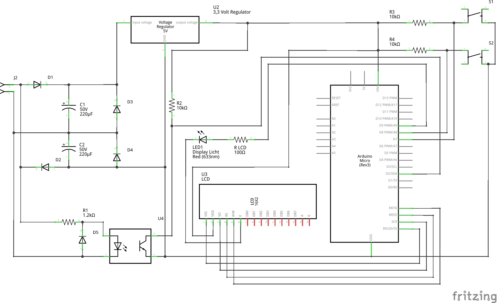

# fahrradtacho
An Arduino-Project for displaying your velocity, distance and temperature of your bicycle.

## Libraries

In your arduino IDE install the following libraries:

    * OneWire.h
    * DallasTemperature.h
    * Adafruit_GFX.h
    * Adafruit_PCD8544.h

## Circuit Diagram

## PCB Layout

TBD PCB created with Fritzing
